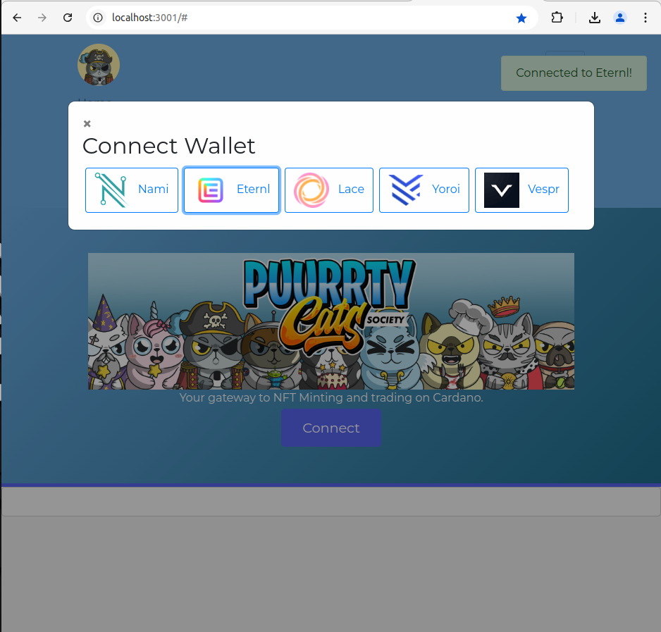
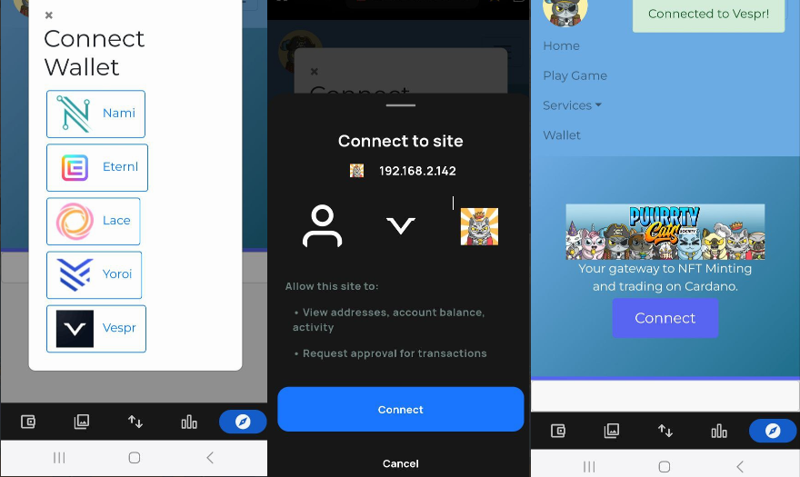

# Purrty Cats NFT Platform

Purrty Cats is an NFT platform built to empower users in the Cardano ecosystem with a variety of functionalities, including NFT minting, staking, marketplace trading, and blockchain-based voting. Additionally, the platform includes a gamified experience using a custom game developed with JavaScript and HTML5 Canvas.

## Features

- **Wallet Integration**: Users can connect using popular Cardano wallets such as Nami, Eternl, Lace, Yoroi, and Vespr. The app allows them to view their wallet balance, manage assets, and use connected wallet addresses for transactions on the platform.
- **NFT Minting and Staking**: A robust NFT minting interface allows users to mint and stake NFTs directly on the Cardano blockchain.
- **Marketplace and Trading**: Users can buy, sell, and trade NFTs in a marketplace with built-in wallet integration.
- **Blockchain-Based Voting**: Implemented a voting system where users can vote on project decisions using blockchain technology for transparency and immutability.
- **Gaming Feature**: The app includes a game where players can compete for high scores. Connected wallet addresses are used to record scores, enabling users to connect their gameplay with their blockchain wallet.
- **Smart Contract Integration**: The platform leverages smart contracts on Cardano to automate interactions like staking rewards, NFT trading, and governance voting.

## Technology Stack

- **Frontend**: HTML, CSS, JavaScript (with Axios for API requests)
- **Backend**: Java, Spring Boot, REST APIs
- **Blockchain**: Cardano blockchain integration through Blockfrost API
- **Wallets Supported**: Nami, Eternl, Lace, Yoroi, Vespr

## Running the App

1. **Wallet Connection**: Users need to connect a supported wallet to interact with blockchain features.
2. **Minting and Trading**: Access the 'Minting', 'Marketplace', and 'Voting' sections under 'Services' in the navbar.
3. **Play the Game**: Navigate to the 'Play Game' button after connecting a wallet to record your scores.
4. **Blockchain API**: Integrated with Blockfrost API using a project ID for asset and wallet interactions.

## Installation

1. **Clone the Repository**: 
   ```bash
   git clone https://github.com/your-repo/purrty-cats-nft-platform.git
   ```
2. **Navigate to the Project Directory**:
   ```bash
   cd purrty-cats-nft-platform
   ```
3. **Run the Application**:
   Start the backend server and ensure front-end dependencies are set up. Connect to wallets and access platform features via supported browsers.

## License

This project is licensed under the MIT License.

---

Developed by Patrick as a part of exploring the Cardano blockchain ecosystem.
